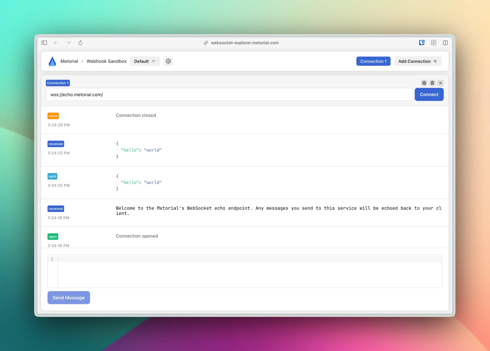

<h1 align="center">Metorial Websocket Explorer</h1>

Test and debug Websocket APIs 💌 🛜

## Features

- **🚀 Simple Setup** - Connect to WebSocket endpoints instantly without complex configuration.
- **🔍 Inspect Websocket Messages** - View incoming and outgoing messages in real time with a clean interface.
- **📦 Built-in Support for JSON Messages** - Syntax highlighting and automatic formatting for easy readability.
- **🔗 Multiple Connections** - Open multiple WebSocket connections side by side for testing broadcasting and real-time interactions.
- **📜 History** - Keep track of sent and received messages.
- **📡 Automatic Ping Messages** - Configure custom ping intervals to maintain connections and simulate real-world conditions.

## Motivation

We needed a simple tool to test and debug our Websocket APIs. We couldn't find one that was simple and easy to use, so we built one.

Metorial Websocket Explorer aims to be fully featured, yet super simple to use. It allows you to open multiple connections next to each other so you can make sure that broadcasting works as expected. It also has built-in support for JSON messages, so you get nice syntax highlighting and formatting.

## Screenshot

## Usage

We have a hosted instance at [`https://websocket-explorer.metorial.com`](https://websocket-explorer.metorial.com) (no signup required). You can also run your own instance by following the instructions below.

### Installation

1. Clone the repository
2. Install dependencies with `yarn`
3. Build the project with `yarn build`
4. Start a preview server with `yarn preview`
5. That's it! 🎉

## Development

We welcome contributions! If you have an idea for a feature or found a bug, please open an issue or a pull request.

# License

This project is licensed under the Apache 2.0 License - see the [LICENSE](LICENSE) file for details.

  Built with ❤️ by <a href="https://metorial.com">Metorial</a>

